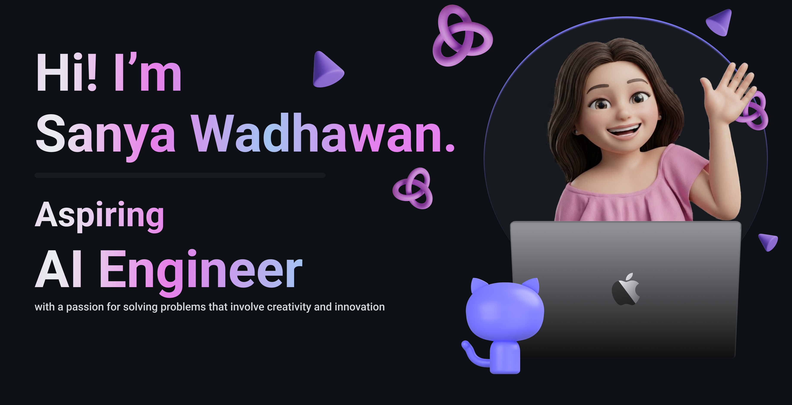
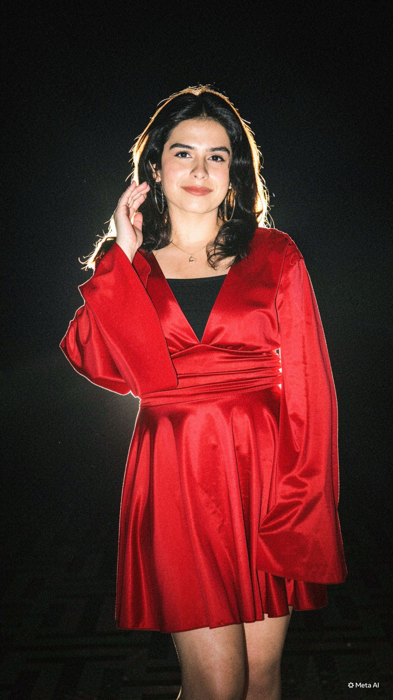

  

<h1 align="center">Hey there, I'm Sanya Wadhawan 👋</h1>

  

  
  
  

 

## ✨ About Me

<table>
  <tr>
    <td width="65%" valign="top">

I'm a Computer Science undergraduate at **BITS Pilani, Dubai Campus**, pursuing a minor in **Data Science** and selected for the **NUS AI Young Fellowship Programme 2026**.

I build applied AI/ML systems that make technical problems more understandable, measurable, and useful. My work spans trustworthy AI, explainability, computer vision, LLM evaluation, and enterprise software.

- 🧠 Exploring **mechanistic interpretability** and **hallucination detection**
- 🔍 Building explainable, evaluation-driven AI systems
- 👁️ Developing OCR-grounded and multimodal vision applications
- ⚙️ Experienced with backend and enterprise applications using **SAP BTP** and **CAP**
- 🌱 Open to internships and early-career roles in AI/ML, data science, and software engineering

    </td>
    <td width="35%" align="center">
      
    </td>
  </tr>
</table>

 

## 🚀 Selected Work

| Project | What I built |
| :-- | :-- |
| [Mechanistic Hallucination Detection](https://github.com/sanya28wd/Mechanistic-Hallucination-Detection-in-Language-Models) | A research pipeline using representation analysis, attention signals, causal interventions, and activation patching to identify hallucinations in LLMs. |
| [MiniVision UAE Road Scene Intelligence](https://github.com/sanya28wd/MiniVision-UAE-road-scene-Intelligence) | An OCR-grounded vision-language system for road-scene captioning, visual question answering, and safety-risk assessment. |
| [Explainable Intrusion Detection](https://github.com/sanya28wd/Explainable-AI-Driven-Machine-Learning-Approaches-for-Intrusion-Detection-) | A CIC-IDS2017 ML pipeline with SHAP and LIME explanations for interpretable network-intrusion detection. |
| [Road Accident Severity Prediction](https://github.com/sanya28wd/Road-Accident-Severity-Prediction) | An end-to-end crash-severity decision-support system with model comparison, explainability, hotspot analysis, and Streamlit. |
| [Customer Loyalty Application](https://github.com/sanya28wd/Customer-Reward-Application) | A SAP CAP and Fiori Elements application for customer management, rewards, redemptions, and OData V4 services. |
| [Incident Management Application](https://github.com/sanya28wd/Incident-Management-Application) | A cloud-native SAP CAP workflow for incident tracking, prioritisation, conversation history, and status management. |

 

## 🛠️ Skills & Tools

  Tools I use to take an idea from research and experimentation to production-ready software.

<table align="center">
  <tr>
    <td align="center" width="25%">
      <b>AI & Machine Learning</b>  
        
      PyTorch · scikit-learn · XGBoost · LightGBM · SHAP · LIME
    </td>
    <td align="center" width="25%">
      <b>Languages</b>  
        
      Python · Java · C/C++ · JavaScript · TypeScript · SQL
    </td>
  </tr>
  <tr>
    <td align="center" width="25%">
      <b>Backend & Enterprise</b>  
        
      REST APIs · SAP BTP · SAP CAP · Fiori Elements · OData V4
    </td>
    <td align="center" width="25%">
      <b>Developer Workflow</b>  
        
      Git · Docker · Postman · Jupyter · Gradio · Streamlit
    </td>
  </tr>
</table>

 

## 📊 GitHub Analytics

  
  

  

  

 

## 🚀 Contribution Space Shooter

  

 

## 🤝 Let's Connect

  
  <a href="<YOUR_INSTAGRAM_URL>">
    
  </a>
  

 

  <i>Building intelligent systems that are explainable, reliable, and useful.</i>

  

