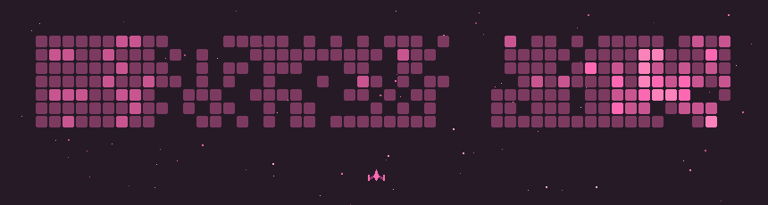

  

  

## About

I’m a Computer Science undergraduate at BITS Pilani, Dubai Campus, pursuing a minor in Data Science and selected as one of the 109 participants from 70+ universities among 26 nationalities globally for the NUS AI Young Fellowship Programme 2026.

I build applied AI/ML systems that make technical problems more understandable, measurable, and useful. My work spans trustworthy AI, explainability, LLM evaluation, computer vision, and enterprise software built with SAP BTP and CAP.

Across my projects and internship experience, I keep returning to three questions:

- Can we trust the system?
- Can we explain its decisions?
- Can someone actually use what we build?

I’m currently exploring mechanistic interpretability, hallucination detection, OCR-grounded vision systems, and evaluation-driven AI applications.

 

## 💗 Featured Work

| Project | Why it matters |
|---|---|
|  | Investigates whether hallucinations leave detectable signals inside language models, rather than checking only the final answer. |
|  | Grounds vision-language systems in OCR, route signs, hazards, and local road-scene context. |
|  | Combines network-threat prediction with SHAP and LIME so analysts can understand why traffic was flagged. |
|  | Turns crash data into an explainable decision-support workflow with severity prediction and hotspot analysis. |
|  | Converts real business rules into a working SAP CAP and Fiori enterprise workflow. |
|  | Models incident priority, status, conversations, and resolution as a cloud-native B2B system. |

 

## 🛠️ Skills & Tools

<h3 align="center">From AI experimentation to deployable, real-world products.</h3>

<table align="center">
  <tr>
    <td align="center" width="25%">
      <b>AI & Machine Learning</b>  
        
      PyTorch · scikit-learn · XGBoost · LightGBM · SHAP · LIME
    </td>
    <td align="center" width="25%">
      <b>Languages</b>  
        
      Python · Java · C/C++ · JavaScript · TypeScript · SQL
    </td>
  </tr>
  <tr>
    <td align="center" width="25%">
      <b>Backend & Enterprise</b>  
        
      REST APIs · SAP BTP · SAP CAP · Fiori Elements · OData V4
    </td>
    <td align="center" width="25%">
      <b>Developer Workflow</b>  
        
      Git · Docker · Postman · Jupyter · Gradio · Streamlit
    </td>
  </tr>
</table>

 

## 📊 GitHub Analytics

  
  

  

  

 

## 💗 Pink Contribution Space Shooter

  

 

## 💗 Connect & Collaborate

  <b>Open to AI/ML engineering opportunities, meaningful collaborations, and conversations about useful AI products.</b>

  
  
  

 

  <i>Let’s build intelligent systems that are explainable, reliable, and useful.</i>

  

